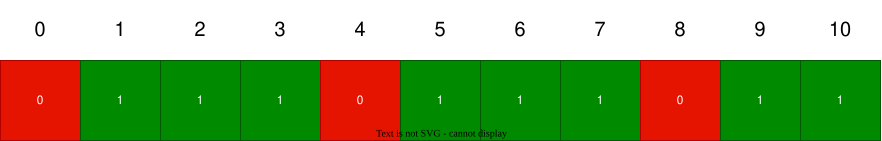

# Introdução à Teoria dos Jogos
Teoria dos Jogos é um ramo da matemática que estuda estratégias em situações de conflito ou cooperação entre diferentes agentes racionais.

Em programação competitiva, a teoria dos jogos é frequentemente aplicada para resolver problemas que envolvem decisões estratégicas entre dois jogadores, como jogos de tabuleiro, jogos de cartas, e outros cenários onde os jogadores precisam tomar decisões baseadas nas ações dos outros.

O objetivo geralmente é achar uma estratégia ótima para um jogador, considerando que o outro jogador também está tentando maximizar seu próprio resultado. A teoria dos jogos fornece ferramentas e conceitos para analisar essas situações e determinar as melhores estratégias possíveis.

Como veremos, uma enorme quantidade de jogos podem ser resolvidos a partir de um jogo chamado *Jogo de Nim* e suas variações, mas primeiramente veremos alguns conceitos básicos da teoria dos jogos.

## Análise de Estados
Muitos jogos podem ser representados como uma árvore de estados, onde cada nó representa um estado do jogo e as arestas representam as ações possíveis que os jogadores podem tomar. Cada estado pode ser classificado como:
- **Estado Vencedor**: Um estado do jogo em que o jogador que está prestes a jogar tem uma estratégia que garante a vitória, independentemente das ações do adversário.
- **Estado Perdedor**: Um estado do jogo em que o jogador que está prestes a jogar não tem uma estratégia que garanta a vitória, assumindo que o adversário jogue de forma ótima.

O interessante é que é possível determinar a classificação de cada estado olhando apenas os estados que podem ser alcançados a partir dele. Se pelo menos um dos estados alcançáveis for um estado perdedor, então o estado atual é um estado vencedor, pois o jogador pode forçar o adversário a entrar em um estado perdedor. Por outro lado, se todos os estados alcançáveis forem estados vencedores, então o estado atual é um estado perdedor, pois o jogador não tem como evitar que o adversário vença.

Resumindo:
- Um estado é **vencedor** se pelo menos um dos estados alcançáveis for **perdedor**.
- Um estado é **perdedor** se todos os estados alcançáveis forem **vencedores**.

Normalmente se começa classificando os estados terminais do jogo, que são estados em que o jogo termina e não há mais movimentos possíveis e portando são estados perdedores. A partir desses estados terminais, é possível propagar a classificação para os estados anteriores na árvore de estados, até chegar ao estado inicial do jogo.

// To do: Imagem de Exemplo de árvore de estados

### Jogo da Pilha
Um jogo clássico envolve uma pilha de objetos (geralmente gravetos ou pedras) e dois jogadores que se revezam removendo objetos da pilha. O jogador que remove o último objeto vence o jogo. O número de objetos que um jogador pode remover em sua vez é limitado a um número máximo, que é definido no início do jogo. A estratégia vencedora para este tipo de jogo pode ser determinada analisando os estados do jogo e aplicando a classificação de estados vencedores e perdedores.

Por exemplo, considere um jogo com uma pilha de 10 objetos, onde cada jogador pode remover 1, 2 ou 3 objetos por vez. Podemos definir cada estado como o número de objetos restantes na pilha. O estado inicial é 10. A partir desse estado, os jogadores podem alcançar os estados 9, 8 ou 7. O estado 0 é um estado terminal (pois não existem mais movimentos possíveis) e, portanto, é um estado perdedor. A partir daí, podemos classificar os estados anteriores:
- Os estados 1, 2 e 3 são estados vencedores, pois o jogador pode remover todos os objetos restantes e vencer, ou seja, ele pode alcançar o estado 0, que é perdedor.
- O estado 4 é um estado perdedor, pois qualquer movimento leva a um estado vencedor (3, 2 ou 1).
- Os estados 5, 6 e 7 são estados vencedores, pois o jogador pode alcançar o estado 4, que é perdedor.
- O estado 8 é um estado perdedor, pois qualquer movimento leva a um estado vencedor (5, 6 ou 7).
- Por fim, os estados 9 e 10 são estados vencedores, pois o jogador pode alcançar o estado 8, que é perdedor.

Com a análise de estados, podemos determinar que o jogador que começa com 10 objetos tem uma estratégia vencedora, pois ele pode sempre forçar o adversário a entrar em um estado perdedor. Essa mesma análise pode ser aplicado a uma pilha de qualquer tamanho e com diferentes limites de objetos que podem ser removidos em cada jogada.

// Exemplo de implementação
Uma forma de implementar essa análise em código é utilizando programação dinâmica para classificar os estados do jogo, onde utilizamos um array/vetor para armazenar se um estado é vencedor (1), perdedor (0) ou ainda não definido (-1):

```cpp
int size = 10; // tamanho da pilha
int moves = 3; // a quantidade máxima de objetos que podem ser removidos por vez

vll dp(size + 1, -1);

for(int i = 0; i <= size; i++) {
    if(dp[i] != -1) continue;
    dp[i] = 0; // se ainda não foi definido, então é um estado perdedor
    for(int j = i+1; j <= i+moves; j++) {
        dp[j] = 1; // se pode chegar a um estado perdedor, então é um estado vencedor
    }
}
```



!!! note
    Uma outra forma de analisar o jogo da pilha é utilizando o conceito de módulo. Se o número máximo de objetos que podem ser removidos em uma jogada for `k`, então os estados do jogo podem ser classificados com base no valor do estado atual módulo `k + 1`. Se o estado atual for congruente a 0 módulo `k + 1`, então é um estado perdedor, caso contrário, é um estado vencedor.
    
    Essa análise é mais eficiente do que a análise de estados, pois não requer a construção de uma árvore de estados completa, mas é menos geral do que a análise de estados, pois não se aplica a todos os jogos de pilha, apenas àqueles com um número máximo fixo de objetos que podem ser removidos em cada jogada.

A análise de estados pode ser utilizada em jogos onde existe um número finito de estados possíveis e os movimentos possíveis a partir de cada estado são conhecidos, porém em jogos mais complexos esta análise pode se mostrar muito complicada ou até mesmo inviável. Por isso esta técnica muita vezes é utilizada junto de outras técnicas ou como base para o entendimento delas. Porém ainda é muito útil conhecer essa análise, pois se aplica à muitos jogos e ajuda o entendimento de muitos outros conceitos de teoria dos jogos.

A seguir analisaremos o mesmo jogando envolvendo múltiplas pilhas de objetos, que é o caso do Jogo de Nim e suas variações.

## Jogo de Nim
O **Jogo de Nim** é um jogo matemático de estratégia para dois jogadores que envolve várias pilhas de objetos. Os jogadores se revezam removendo qualquer número de objetos de uma única pilha, e o jogador que remove o último objeto vence o jogo. Perceba que essa jogo é parecido com o jogo da pilha que vimos antes, mas com mais pilhas e menos restrição de movimentos.

Nesse jogo, a análise de estados se torna mais complicada, pois cada estado tem que ser representado pelo conjunto de pilhas atuais, incluindo a quantidade de elementos em cada pilha. Também é bem mais difícil criar as transições entre os estados. Por isso, o Jogo de Nim apresenta uma estratégia diferente para decidir se um estado é vencedor ou perdedor.

### Estratégia

A estratégia para o jogo de Nim pode não parecer muito intuitiva a principio, por isso primeiro mostraremos a estratégia e como utiliza-la e depois mostraremos porque ela funciona.

A estratégia vencedora do Jogo de Nim pode ser determinada usando a operação XOR (ou exclusivo) dos tamanhos das pilhas. Se o XOR de todos os tamanhos das pilhas for zero, o jogador que está prestes a jogar está em uma posição perdedora, caso contrário, ele está em uma posição vencedora. Assim podemos determinar se um estado é vencedor olhando apenas os tamanhos das pilhas.

### Explicação
