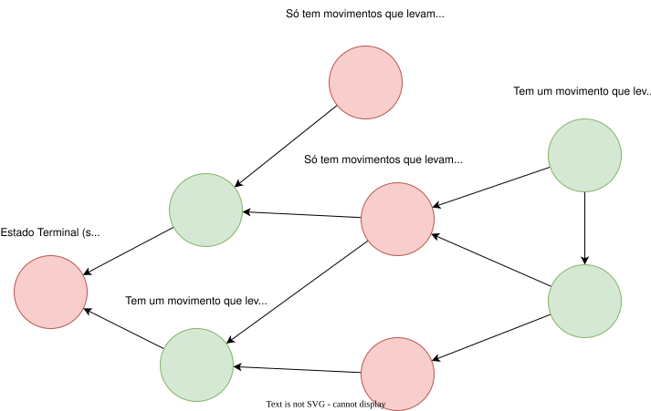

# Introdução à Teoria dos Jogos
Teoria dos Jogos é um ramo da matemática que estuda estratégias em situações de conflito ou cooperação entre diferentes agentes racionais.

Em programação competitiva, a teoria dos jogos é frequentemente aplicada para resolver problemas que envolvem decisões estratégicas entre dois jogadores, como jogos de tabuleiro, jogos de cartas, e outros cenários onde os jogadores precisam tomar decisões baseadas nas ações dos outros.

O objetivo geralmente é achar uma estratégia ótima para um jogador, considerando que o outro jogador também está tentando maximizar seu próprio resultado. A teoria dos jogos fornece ferramentas e conceitos para analisar essas situações e determinar as melhores estratégias possíveis.

A grande maioria dos jogos vistos em problemas de programação competitiva envolvendo teoria dos jogos são jogos determinísticos (onde toda jogado possível é conhecida por ambos os jogadores em todo momento) e simétricos (onde as jogados independem do jogador atual). Esse tipo de problemas tem a vantagem de não terem elementos aleatórios e de sempre existir uma estratégia ótima que garante a vitória para algum jogador, tornando esses jogos ideais para problemas de programação.

Alguns problemas envolvem apenas dizer se um certo estado do jogo é vencedor ou perdedor (isto é, se o jogador com o movimento tem uma estratégia que força a vitória ou não) enquanto outros podem envolver jogar o jogo em si com a melhor estratégia. Isso é mais comum em problemas iterativos.

Como veremos, uma enorme quantidade de jogos podem ser resolvidos a partir de um jogo chamado *Jogo de Nim* e suas variações, mas primeiramente veremos alguns conceitos básicos da teoria dos jogos.

## Análise de Estados
Muitos jogos podem ser representados como uma árvore ou grafo de estados, onde cada nó representa um estado do jogo e as arestas representam as ações possíveis que os jogadores podem tomar. Cada estado pode ser classificado como:

- **Estado Vencedor**: Um estado do jogo em que o jogador que está prestes a jogar tem uma estratégia que garante a vitória, independentemente das ações do adversário.
- **Estado Perdedor**: Um estado do jogo em que o jogador que está prestes a jogar não tem uma estratégia que garanta a vitória, assumindo que o adversário jogue de forma ótima.

O interessante é que é possível determinar a classificação de cada estado olhando apenas os estados que podem ser alcançados a partir dele. Se pelo menos um dos estados alcançáveis for um estado perdedor, então o estado atual é um estado vencedor, pois o jogador pode forçar o adversário a entrar em um estado perdedor. Por outro lado, se todos os estados alcançáveis forem estados vencedores, então o estado atual é um estado perdedor, pois o jogador não tem como evitar que o adversário vença.

Resumindo:

- Um estado é **vencedor** se pelo menos um dos estados alcançáveis for **perdedor**.
- Um estado é **perdedor** se todos os estados alcançáveis forem **vencedores**.

Normalmente se começa classificando os estados terminais do jogo, que são estados em que o jogo termina e não há mais movimentos possíveis e portando são estados perdedores. A partir desses estados terminais, é possível propagar a classificação para os estados anteriores na árvore de estados, até chegar ao estado inicial do jogo.

Abaixo um exemplo dos estados de um jogo representados por um grafo, onde estados perdedores estão em vermelho e estados vencedores estão em verde.



### Jogo da Pilha
Um jogo clássico envolve uma pilha de objetos (geralmente gravetos ou pedras) e dois jogadores que se revezam removendo objetos da pilha. O jogador que remove o último objeto vence o jogo. O número de objetos que um jogador pode remover em sua vez é limitado a um número máximo, que é definido no início do jogo. A estratégia vencedora para este tipo de jogo pode ser determinada analisando os estados do jogo e aplicando a classificação de estados vencedores e perdedores.

Por exemplo, considere um jogo com uma pilha de 10 objetos, onde cada jogador pode remover 1, 2 ou 3 objetos por vez. Podemos definir cada estado como o número de objetos restantes na pilha. O estado inicial é 10. A partir desse estado, os jogadores podem alcançar os estados 9, 8 ou 7. O estado 0 é um estado terminal (pois não existem mais movimentos possíveis) e, portanto, é um estado perdedor. A partir daí, podemos classificar os estados anteriores:

- Os estados 1, 2 e 3 são estados vencedores, pois o jogador pode remover todos os objetos restantes e vencer, ou seja, ele pode alcançar o estado 0, que é perdedor.
- O estado 4 é um estado perdedor, pois qualquer movimento leva a um estado vencedor (3, 2 ou 1).
- Os estados 5, 6 e 7 são estados vencedores, pois o jogador pode alcançar o estado 4, que é perdedor.
- O estado 8 é um estado perdedor, pois qualquer movimento leva a um estado vencedor (5, 6 ou 7).
- Por fim, os estados 9 e 10 são estados vencedores, pois o jogador pode alcançar o estado 8, que é perdedor.

Com a análise de estados, podemos determinar que o jogador que começa com 10 objetos tem uma estratégia vencedora, pois ele pode sempre forçar o adversário a entrar em um estado perdedor. Essa mesma análise pode ser aplicado a uma pilha de qualquer tamanho e com diferentes limites de objetos que podem ser removidos em cada jogada.

Uma forma de implementar essa análise em código é utilizando [programação dinâmica](../../paradigms/dynamic-programming.md) para classificar os estados do jogo, onde utilizamos um array/vetor para armazenar se um estado é vencedor (1), perdedor (0) ou ainda não definido (-1):

```cpp
int size = 10; // tamanho da pilha
int moves = 3; // a quantidade máxima de objetos que podem ser removidos por vez

vll dp(size + 1, -1);

for(int i = 0; i <= size; i++) {
    if(dp[i] != -1) continue;
    dp[i] = 0; // se ainda não foi definido, então é um estado perdedor
    for(int j = i+1; j <= i+moves; j++) {
        dp[j] = 1; // se pode chegar a um estado perdedor, então é um estado vencedor
    }
}
```

Abaixo a representação do vetor de estados do jogo da pilha, com estados perdedores em vermelho e estados vencedores em verde.


!!! note
    Uma outra forma de analisar o jogo da pilha é utilizando o conceito de módulo. Se o número máximo de objetos que podem ser removidos em uma jogada for `k`, então os estados do jogo podem ser classificados com base no valor do estado atual módulo `k + 1`. Se o estado atual for congruente a 0 módulo `k + 1`, então é um estado perdedor, caso contrário, é um estado vencedor.
    
    Essa análise é mais eficiente do que a análise de estados, pois não requer a construção de uma árvore de estados completa, mas é menos geral do que a análise de estados, pois não se aplica a todos os jogos de pilha, apenas àqueles com um número máximo fixo de objetos que podem ser removidos em cada jogada.

A análise de estados pode ser utilizada em jogos onde existe um número finito de estados possíveis e os movimentos possíveis a partir de cada estado são conhecidos, porém em jogos mais complexos esta análise pode se mostrar muito complicada ou até mesmo inviável. Por isso esta técnica muita vezes é utilizada junto de outras técnicas ou como base para o entendimento delas. Porém ainda é muito útil conhecer essa análise, pois se aplica à muitos jogos e ajuda o entendimento de muitos outros conceitos de teoria dos jogos.

A seguir analisaremos o mesmo jogando envolvendo múltiplas pilhas de objetos, que é o caso do Jogo de Nim e suas variações.

## Jogo de Nim

O **Jogo de Nim** é um jogo matemático de estratégia para dois jogadores que envolve várias pilhas de objetos. Os jogadores se revezam removendo qualquer número de objetos de uma única pilha, e o jogador que remove o último objeto vence o jogo. Perceba que essa jogo é parecido com o jogo da pilha que vimos antes, mas com mais pilhas e menos restrição de movimentos.

!!! tip "Dica"
    Como veremos, muito outros jogos podem ser jogados da mesma forma que o Jogo de Nim, mesmo que a principio pareçam bem distintos. Por isso esse jogo é um dos mais importantes a serem estudados.

Nesse jogo, a análise de estados se torna mais complicada, pois cada estado tem que ser representado pelo conjunto de pilhas atuais, incluindo a quantidade de elementos em cada pilha, utilizando um vetor, por exemplo. Também é bem mais difícil criar as transições entre os estados. Por isso, o Jogo de Nim apresenta uma estratégia diferente para decidir se um estado é vencedor ou perdedor.

### Estratégia

A estratégia para o jogo de Nim pode não parecer muito intuitiva a principio, por isso primeiro mostraremos a estratégia e como utiliza-la e depois mostraremos porque ela funciona.

Representamos o estado atual do jogo como um vetor $x=[x_1, x_2, \dots, x_n]$, onde $x_k$ representa o número de elementos na pilha $k$. Chamamos de **soma de nim** o XOR (ou exclusivo) de todas as pilhas, ou seja $s=x_1 \oplus x_2 \oplus \dots \oplus x_n$. Se $s$ for zero, o jogador que está prestes a jogar está em uma posição perdedora, caso contrário, ele está em uma posição vencedora. Assim podemos determinar se um estado é vencedor olhando apenas os tamanhos das pilhas.

### Explicação
Para mostrar que essa estratégia realmente funciona, iremos mostrar 3 coisas:

1. O estado final $[0, 0, \dots, 0]$ é um estado perdedor e tem $s=0$, como esperado.
2. Em um estado com $s=0$, qualquer mudança em um único valor do vetor também altera o valor de $s$, o que torna $s\neq 0$, e portando sempre leva à um estado vencedor, que é o comportamento esperado de um estado perdedor.
3. Por último, vamos provar que para um estado com $s \neq 0$ sempre é possível levar à um estado perdedor com $s=0$. Para isso, precisamos achar uma pilha $k$ com $x_k \oplus s < x_k$, pois podemos remover elementos da pilha $k$ até sobrarem $x_k \oplus s$ elementos na pilha, o que torna $s=0$. Sabemos que sempre existe uma pilha com esse propriedade pois sempre existe um $x_k$ que tem $1$ no bit na mesma posição do bit $1$ mais a esquerda (ou mais significativo) de $s$, o que torna $x_k \oplus s < x_k$ sempre.

!!! note "Nota"
    Escolher diminuir $x_k$ para $x_k \oplus s$ torna a nova soma de nim igual zero pois o XOR de todos os elementos exceto $x_k$ pode ser escrito como $x_1 \oplus x_2 \oplus \dots \oplus x_n \oplus x_k=s \oplus x_k$ (relembre as propriedades do XOR), e então a nova soma de nim se torna $s\oplus x_k \oplus x_k \oplus s=0$.

!!! note "Nota"
    Sempre existe $x_k > x_k \oplus s$ pois se pegarmos a posição do bit $1$ mais à esquerda ou significativo de $s$, deve haver um $x_k$ com bit $1$ nesta mesma posição, pois caso contrário o próprio $s$ não poderia ter um bit $1$ naquela posição, pois é o XOR de todos os $x_k$.
    
    E esse $x_k \oplus s$ será menor que o próprio $x_k$ pois ele terá o bit $1$ naquela posição removida e não terá nenhum bit acrescentado em um posição mais à esquerda (pois aquele já era o bit mais à esquerda de $s$), e mesmo que todos os bits menos significativos que esse sejam trocados de $0$ para $1$, aquele bit sozinho tem valor maior que todos esses outros bits somados (lembre das propriedades dos números binários), logo o valor tem que diminuir.

Ou seja, nessa estratégia, estados vencedores sempre podem levar à estados perdedores e estados perdedores só podem levar à estados vencedores, o que condiz com a análise de estados esperada.

## Problemas

### Recomendados
- [Nim Game I](https://cses.fi/problemset/task/1730)
- [Nim Game II](https://cses.fi/problemset/task/1098)
- [Stones](https://atcoder.jp/contests/dp/tasks/dp_k)
- [Removal Game](https://cses.fi/problemset/task/1097)
- [Game on Tree](https://atcoder.jp/contests/agc017/tasks/agc017_d)

### Adicionais
- [Tree Tag](https://codeforces.com/contest/1404/problem/B)
- [Game of Pairs](https://codeforces.com/contest/1404/problem/D)
- [Sagheer and Apple Tree](https://codeforces.com/contest/812/problem/E)
- [Game of Stones](https://codeforces.com/problemset/problem/768/E)
- [Arpa and a game with Mojtaba](https://codeforces.com/contest/850/problem/C)
- [Interval Game 2](https://atcoder.jp/contests/abc206/tasks/abc206_f)
- [Strange Nim](https://atcoder.jp/contests/arc091/tasks/arc091_d)

## Outros Recursos
- [Geeks For Geeks](https://www.geeksforgeeks.org/dsa/game-theory/)
- [USACO Guide](https://usaco.guide/adv/game-theory?lang=cpp)
- [Geeks For Geeks - Practice Problems](https://www.geeksforgeeks.org/dsa/practice-problems-on-game-theory/)
- [Codeforces Blog](https://codeforces.com/blog/entry/66040)
