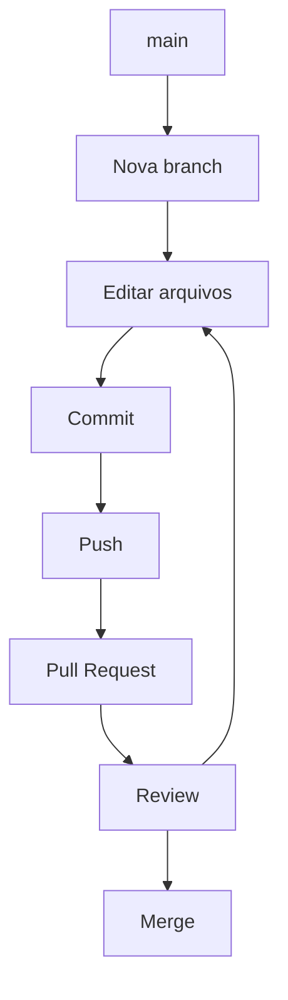

# Como Usar o Github

Este guia tem como objetivo ajudar a você a contribuir com o projeto de Programação Competitiva da UTFPR no [Github](https://github.com/eduardo-marca/utfpr-guia-programacao-competitiva). Aqui mostraremos os principais comandos e o fluxo correto de trabalho.

!!! warning "Importante"
    Este não é um tutorial completo de Github, mas apenas uma introdução para você começar a contribuir com os principais comandos utilizados. É esperado que você conheça o básico de como usar o Github.

    Para mais informações sobre como usar o Github, consulte [aqui](https://docs.github.com/pt/get-started).

## Fluxo de Trabalho

Toda mudança na branch `main` afeta diretamente a página do site. Portanto, toda nova mudança deve ser feita em uma branch diferente e então deve ser criado um *pull request* para a branch `main`. No pull request as mudanças podem ser verificadas, melhoradas e então aprovadas para serem commitadas na branch `main`.



## Passo a Passo

### Atualizar o Repositório
```bash
git checkout main
git pull
```

Aqui você está atualizando o seu repositório local com a última versão do repositório remoto.

### Criar uma Branch
```bash
git checkout -b bfs-guide
```

### Commit
```bash
git add .

git commit -m "Add BFS guide"
```

Aqui você poderá editar os arquivos do site e adicionar as mudanças à sua branch. Você pode fazer diversos commits se for necessário.

### Push
```bash
git push origin bfs-guide
```

### Pull Request
Pelo site to Github é possível abir uma Pull Request para o [repositório](https://github.com/eduardo-marca/utfpr-guia-programacao-competitiva) na aba *Pull requests*.

!!! tip
    Não é necessário abrir vários *pull requests* para a mesma branch. A cada revisão você pode commitar na mesma branch e o *pull request* será atualizado automaticamente.

### Review e Merge
Depois de possíveis revisões e correções, a branch é "mergeada" no repositório principal e o site será atualizado com as mudanças.

## Boas Práticas
- Uma feature por branch.
- Commits pequenos.
- Escreva mensagens claras.
- Atualize sua branch antes de abrir um PR.
