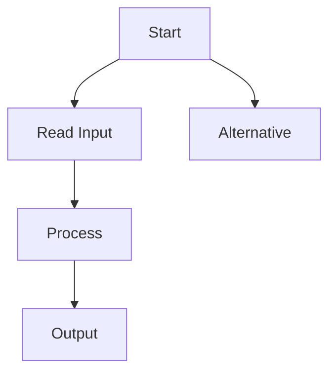

# Como usar o Mkdocs e Material for MkDocs

Esta página tem como objetivo ensinar como editar o site com o MkDocs e como usar os recursos do Material for MkDocs.

O MkDocs é um gerador de sites estáticos rápido e simples, sem a necessidade de HTML, CSS ou Javascript (apesar de permitir o uso desses recursos), usando apenas Markdown. Além disso usamos o tema Material for MkDocs, que torna o site mais agradável e personalizável.

## Referências
- [Introdução ao MkDocs](https://www.mkdocs.org/getting-started/)
- [Guia do Usuário MkDocs](https://www.mkdocs.org/user-guide/)
- [Tema Material for MkDocs](https://squidfunk.github.io/mkdocs-material/)

## Estrutura do Site

No repositório você encontrará diversos arquivos e pastas. Os mais importantes são descritos abaixo.

### Pasta `docs`
Onde estão os arquivos Markdown que serão convertidos em HTML. Aqui é onde você cria e edita as pastas de fato. A estrutura interna dessa pasta não afeta o funcionamento do site diretamente.

### Aquivo `mkdocs.yml`
É o arquivo mais importante do site. Onde estão as configurações do site, como o tema, a cor de fundo, plugins, etc.

Também é aqui que encontra o *nav*, que define como o site mostra os menus do site.

### Arquivo `requirements.txt`
É o arquivo que define as dependências do site, como a biblioteca Markdown.

Você pode baixar as dependências com o comando:
```bash
pip install -r requirements.txt
```

Você também pode atualizar as dependências com o comando:
```bash
pip freeze > requirements.txt
```

## O Que o Markdowm Permite?
---
### Títulos

//# Título 1
//## Título 2

Aqui os títulos 1 e 2 foram emitidos pois quebrariam a estrutura da página.
### Título 3
#### Título 4

---
### Parágrafos
Este é um parágrafo.

Este é outro parágrafo.

---
### Negrito e Itálico
**texto**

*texto*

---
### Listas
- Item 1
- Item 2
- Item 3

---
### Listas numeradas
1. Primeiro
2. Segundo
3. Terceiro

---
### Links

#### Links Externos
[Codeforces](https://codeforces.com)

#### Links Dentro do Site
[Busca Binária](../algorithms/basic-algorithms/binary-search.md)

#### Links Dentro da Página
[Tabelas](#tabelas)

---
### Imagens


---
### Código
#### Inline
Use a função `sort`.

#### Blocos
```cpp
vector<int> v;
sort(v.begin(), v.end());
```

---
### Matemática
$$
O(N \log N)
$$

$$
\sum_{i=1}^{n} i
=
\frac{n(n+1)}{2}
$$

---
### Avisos
!!! note
    Esta é uma observação.

!!! tip
    Dica importante.

!!! warning
    Cuidado com overflow.

!!! danger
    Esta solução gera TLE.

---
### Exemplos recolhíveis
??? example
    Esta é uma solução alternativa.

---
### Tabelas
| Estrutura | Inserção |
|------------|-----------|
| Set        | O(log N) |
| Vector     | O(1)     |

---
### Diagramas
O tema Material suporta Diagramas Mermaid.



---
### Abas
=== "C++"

    ```cpp
    cout << "Hello";
    ```

=== "Python"

    ```python
    print("Hello")
    ```
