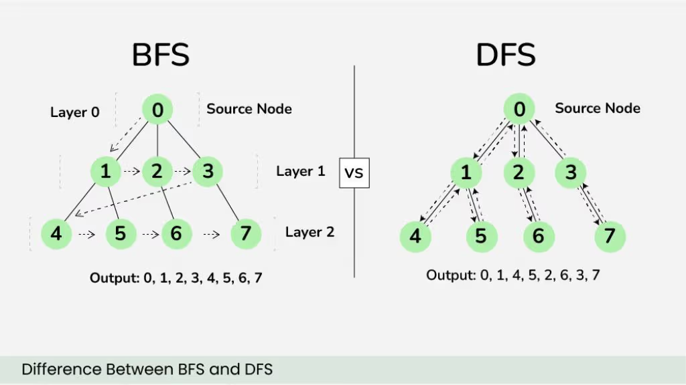
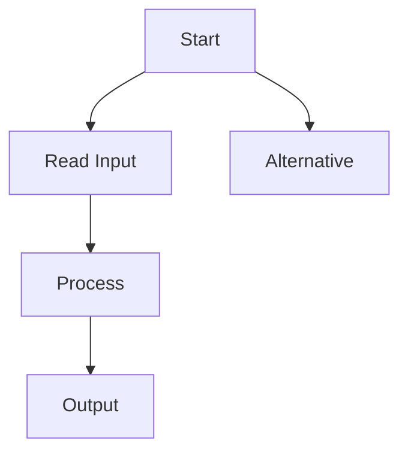

# O que o Markdown básico permite
[Introdução MkDocs](https://www.mkdocs.org/getting-started/)

[Guia do Usuário MkDocs](https://www.mkdocs.org/user-guide/)

---
## Títulos

//# Título 1
## Título 2
### Título 3
#### Título 4

---
## Parágrafos
Este é um parágrafo.

Este é outro parágrafo.

---
## Negrito e Itálico
**texto**

*texto*

---
## Listas
- Item 1
- Item 2
- Item 3

---
## Listas numeradas
1. Primeiro
2. Segundo
3. Terceiro

---
## Links
[Codeforces](https://codeforces.com)

---
## Imagens


---
## Código
### Inline
Use a função `sort`.

### Blocos
```cpp
vector<int> v;
sort(v.begin(), v.end());
```

---
## Matemática
$$
O(N \log N)
$$

$$
\sum_{i=1}^{n} i
=
\frac{n(n+1)}{2}
$$

---
## Avisos
!!! note
    Esta é uma observação.

!!! tip
    Dica importante.

!!! warning
    Cuidado com overflow.

!!! danger
    Esta solução gera TLE.

---
## Exemplos recolhíveis
??? example
    Esta é uma solução alternativa.

---
## Tabelas
| Estrutura | Inserção |
|------------|-----------|
| Set        | O(log N) |
| Vector     | O(1)     |

---
## Diagramas
O tema Material suporta Diagramas Mermaid.



---
## Abas
=== "C++"

    ```cpp
    cout << "Hello";
    ```

=== "Python"

    ```python
    print("Hello")
    ```
